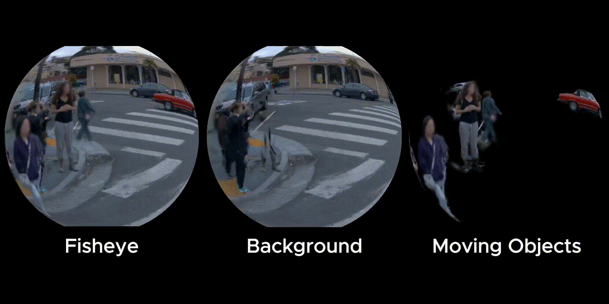

<div align="center">
<h1><code>gsplat-geer</code>: An Open-Source Library for Exact and Efficient Gaussian Rendering</h1>
</div>

`gsplat-geer` is an extension of the open-source [`gsplat`](https://github.com/nerfstudio-project/gsplat) library from [Nerfstudio](https://docs.nerf.studio/) for 3DGEER-based rasterization.

## 📷`gsplat` Rasterization
This repo extends the [`rasterization()`](https://docs.gsplat.studio/versions/1.5.3/apis/rasterization.html) function provided by `gsplat` to rasterize 3D Gaussians to image planes. The argument `with_geer: bool = False` rasterizes Gaussians using the 3DGEER's PBF algorithm when set to True. For users using this function, note:

- `with_geer=True` only works with `with_eval3d=True`.
- `with_geer` only renders one image plane at a time.
- Training is most stable with the default strategy.
- To train/render pinhole camera with distortion, set the distortion parameters to `radial_coeffs`, `tangential_coeffs`, `thin_prism_coeffs`.
- To train/render fisheye camera with distortion, 
set the distortion parameters to `radial_coeffs` and set `camera_model="fisheye"`.

These are consistent with `gsplat`'s 3DGUT implementation (`with_ut`).

## 🧩TODO
- [ ] Demo adding CAD models into distorted camera-rendered scenes

## 🏃Quick Start
### Training environment (uv, Linux / CUDA 12.8)

The training environment uses Python 3.11, PyTorch 2.7.1 cu128 and
torchvision 0.22.1 cu128, pinned in `uv.lock`. PyTorch wheels come from the
[SJTU mirror](https://mirrors.sjtug.sjtu.edu.cn/docs/pytorch-wheels); other PyPI
packages use the Tsinghua mirror. Git dependencies retain the commits in
`examples/requirements.txt`.

Install [uv](https://docs.astral.sh/uv/getting-started/installation/), CUDA Toolkit
12.8, and GCC/G++ 14 first (CUDA 12.8 cannot compile with GCC 15). On Ubuntu:

```bash
sudo apt-get install -y g++-14
bash scripts/setup_uv.sh
```

The setup script creates `.venv`, downloads the missing GLM 1.0.1 headers, and
installs the local gsplat package plus training dependencies. It builds
`fused-ssim` and `fused-bilagrid` for the visible GPU; run setup with the training
GPU accessible. gsplat itself compiles on first rendering/training use, which can
take several minutes. No dataset or model weights are downloaded during setup.

On newer glibc systems, setup also creates a local copy of CUDA headers under
`.cache/cuda-include` and fixes the `noexcept` declarations of `sinpi`, `cospi`,
`rsqrt` and their float variants. This addresses the
[CUDA/glibc header incompatibility](https://forums.developer.nvidia.com/t/cuda-headers-in-crt-math-functions-h-still-broken-in-debian-13-repo/362940)
without changing the system toolkit.

Activate these compiler/header settings in each training shell:

```bash
source scripts/activate.sh
uv run python examples/simple_trainer.py --help
```

For subsequent dependency synchronization, source the activation script and run
`uv sync --locked`. To run the
examples below, use `uv run python` in place of `python`; uv finds the project
environment even from the `examples` directory. Conda activation is not required.

### Training
Passing in `--with_geer --with_eval3d` to the `simple_trainer.py` arg list will enable training with 3DGEER.
#### Download Data
Put COLMAP formatted data in `examples/data`. As an example, the command below installs Mip-NeRF 360 benchmark data.
```bash
cd examples
python datasets/download_dataset.py
```
#### Install Dependencies
```bash
# From the repository root:
bash scripts/setup_uv.sh
```
#### Training Script
```bash
CUDA_VISIBLE_DEVICES=0 python simple_trainer.py default \
  --data_dir path/to/data \
  --result_dir path/to/results \
  --with_geer \
  --with_eval3d \
  <OTHER ARGS>
```
For example, to train on the Mip-NeRF 360 garden data, run the following command.
```bash
CUDA_VISIBLE_DEVICES=0 python simple_trainer.py default \
  --data_dir data/360_v2/garden/ \
  --data_factor=4 \
  --result_dir ./results/garden_geer \
  --with_geer \
  --with_eval3d \
  --strategy.max_gaussians 1000000 \
  --strategy.max_grow_per_refine 50000
```
Training metrics are appended as JSON Lines to `<result_dir>/train.log` every
`--log-every` steps. Each record is a standalone JSON object, so the file is
readable with standard text tools and can also be parsed line by line.

#### Caveats
Some caveats about training with our script:
- Default densification is more stable for 3DGEER training. It may be necessary to set the `max_gaussians` and `max_grow_per_refine` (e.g. `--strategy.max_gaussians 1000000 --strategy.max_grow_per_refine 50000`).
- To train on fisheye data, use the flag `--keep_distortion` to avoid undistortion during data parsing.

### Rendering
Once trained, you can view the 3DGS through the nerfstudio-style viewer to export videos. Play around with the fisheye setting and the FOV!

#### Install Dependencies
```bash
# From the repository root (same environment as training):
bash scripts/setup_uv.sh
cd examples
```
#### Rendering Script
```bash
CUDA_VISIBLE_DEVICES=0 python simple_viewer.py \
  --with_geer \
  --with_eval3d \
  --ckpt path/to/ckpt
```
For example, to render the Mip-NeRF 360 garden checkpoint trained by the previous command, run the following command.
```bash
CUDA_VISIBLE_DEVICES=0 python simple_viewer.py \
  --with_geer \
  --with_eval3d \
  --ckpt results/garden_geer/ckpts/ckpt_29999_rank0.pt
```

## ✨Opensource Community 
### `drivestudio-geer` 
> We have released integration with [DriveStudio](https://github.com/ziyc/drivestudio)! In our patch, we provide 3DGEER and 3DGUT training and rendering with a dynamic, temporal Viser viewer for viewing trained representations.


> 🏃To get started, follow the steps [here](app/drivestudio-geer/README.md).

### `stormGaussian-geer`
> TBD

### How to use in your project
> See [./app](app/) for details.

## 🙏Special `gsplat-geer` Extension OSS Acknowledgments
<p align="left">
  <strong>Core Contributors:</strong><br>
  Edward Lee<sup>1,2*</sup> (GEER Public Integration), <br>
  Zixun Huang<sup>1,‡</sup> (GEER Algorithm Derivation / Implementation), <br>
  Cho-Ying Wu<sup>1</sup> (GEER Implementation)
</p>

<p align="left">
  <strong>Senior Mgmt:</strong><br> 
  Wenbin He<sup>1</sup>, Xinyu Huang<sup>1</sup><br>
</p>

<p align="left">
  <strong>Supervision:</strong><br>
  Liu Ren<sup>1</sup>
</p>

<p align="left">
  <strong>Acknowledgements for additional contributions:</strong><br>
  Hengyuan Zhang<sup>1</sup> (Close-Up Parking Data Calibration)
<br>

### Institution Acknowledgements
<p align="left">
  
  &nbsp;&nbsp;&nbsp;&nbsp;
  
</p>

<p align="left">
  <sup>1</sup> <strong>Bosch Center for AI</strong>, Bosch Research North America &nbsp;&nbsp;&nbsp;&nbsp; 
  <sup>2</sup> <strong>Stanford University</strong>
</p>

> The special extension work was performed when <sup>*</sup> worked as an intern at <sup>1</sup> under the mentorship of <sup>‡</sup>.

## 💡License
`gsplat-geer` is released under the AGPL-3.0 License. See the [LICENSE](./LICENSE.md) file for details.
This project is built upon `gsplat` (Apache-2.0 License) by UCB. We thank the authors for their excellent open-source work. The original license and copyright notice are included in this repository, see the file [gsplat-license.txt](./gsplat-license.txt).
